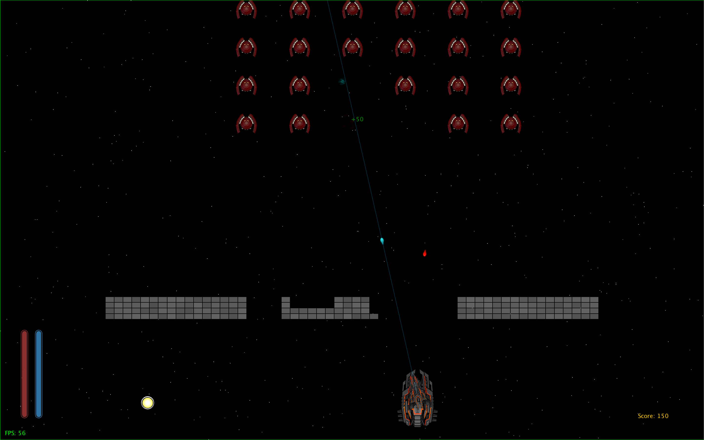
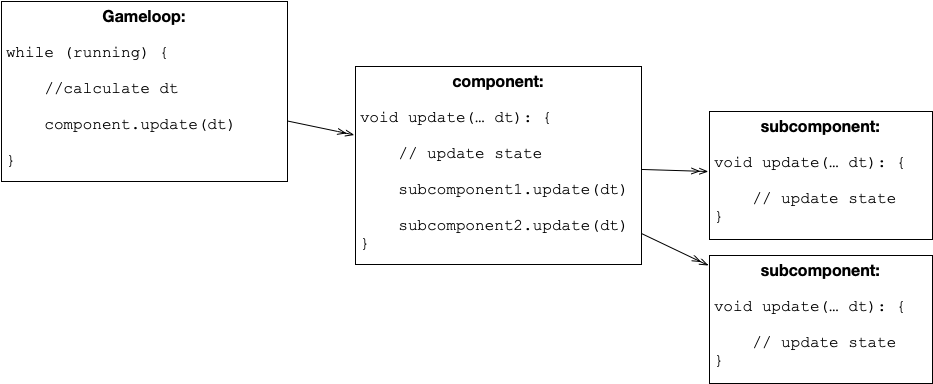
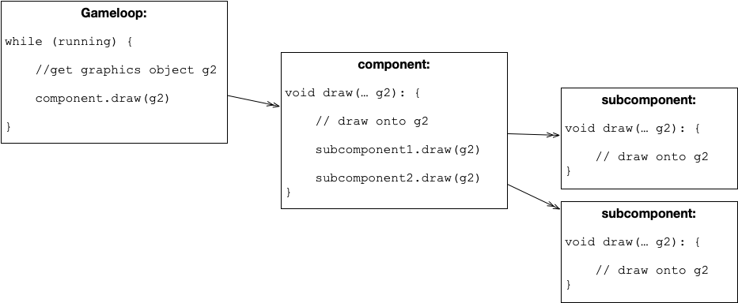

# Computer Science E214 (2020) Project: Cosmic Conquistadors



## Group Members

|      | Name           | Student Number |
| ---- | -------------- | -------------- |
| #1   | Emi Dreckmeyr  | 21604754       |
| #2   | Michael Knight | 23263962       |
| #3   | Nicol Visser   | 16986431       |

## Execution Details

The main class is `MainGame.java` and is located under the `./src/` directory.

```shell
> cd src
```

### Compiling:

#### 1. Compile all java files in the `./src/` directory. (default package)

```shell
> javac *.java
```

#### 2. Compile all java files in the `./src/geom` directory. (geom package)

```shell
> javac geom/*.java
```

### Running:

It is recommended to run the game in fullscreen mode. This might not be possible on your device since we could not do extensive testing on different devices during lockdown. In that case, run in windowed mode. It will also be useful if you can run the game in windowed mode at different window sizes to see the game's support for different aspect ratios.

#### 1. Run in Fullscreen Exclusive Mode (*recommended*):

Execute the main class `MainGame` and add the argument `-f` or `-fullscreen`.

```shell
> java MainGame -f
```

#### 2. Run in Windowed Mode:

To run at default 800x800 window, simply execute the main class without any arguments.

```shell
> java MainGame
```

Otherwise, specify the width and height of window as integer arguments.

E.g. to run in a 1600x1000 pixel window: 

```shell
> java MainGame 1600 1000
```

##### * Visual Debugging Mode:

Visual debugging mode shows the shapes used for collision. **This is helpful to understand how collision detection works and to find bugs.**

To enable visual debugging mode, add the argument `-d` or `-debug` when running the game.

E.g. to run in fullscreen with visual debugging <u>on</u>:

```shell
> java MainGame -f -d
```

## Interface Inheritance

### Interfaces in the `geom` package:

The `geom` package contains objects that can be associated with 2D geometry.

It has two interfaces, the `Shape` interface and an extension of it, the `BoundingShape` interface.

`LineSegment` and `Ray` implement the `Shape` interface, whereas `Rectangle` and `Circle` implement the `BoundingShape` interface.

#### `Shape` Interface:

`Rectangle`, `Circle`, `LineSegment` and `Ray`, by (directly or indirectly) implementing the `Shape` interface, have methods for:

- drawing the shape on a `Graphics2D` object
  - `public boolean intersects(Shape shape);`
- checking whether or not the shape intersects another shape.
  - `public void draw(Graphics2D g);`


#### `BoundingShape` Interface: 

`Rectangle` and `Circle`, by implementing the`BoundingShape` interface, also have methods for

- checking whether or not the bounding shape contains a point
- checking whether or not the bounding shape completely contains another shape
- returning a random point inside the bounding shape

```java
public boolean contains(double x, double y);
public boolean contains(Vector2D point);
public boolean contains(Shape shape);
public Vector2D getRandomPositionInside();
```

### Interfaces in the game (default package)

#### `Collidable` Interface

`Collidable` aids with collision detection and handling.

Classes that implement `Collidable` have methods for:

- returning the `BoundaryShape` used for collision
- checking whether or not the object is colliding with another ` Collidable` object
- handling the collision with another ` Collidable` object, assuming they do collide

```java
public BoundingShape getCollisionShape();
public boolean isCollidingWith(Collidable otherCollidable);
public void handleCollisionWith(Collidable otherCollidable);
```

In our game, the game objects are often stored in `ArrayLists` of the same type. Instead of creating an N body simulation where all `Collidables` are checked against eachother, we rather only check certain groups of `Collidables` with other groups of `Collidables` or an individual `Collidable`. For this approach, two <u>static methods</u> are available to check and handle collisions.

```java
public static void checkAndHandleCollisions(ArrayList<? extends Collidable> group1, ArrayList<? extends Collidable> group2) {
  ...
}

public static void checkAndHandleCollisions(Collidable collidable1, ArrayList<? extends Collidable> group2) {
  ...
}
```

##### Example:

A good example of how Collidable and BoundingShape objects work are in `DefaultCritter.java`.

A `DefaultCritter` object implements the `Collidable` interface. Which means it has a `BoundingShape` associated with it. For a `DefaultCritter` this `BoundingShape` is a `Circle` which you can get from calling the `getCollisionShape()` method.

```java
@Override
public BoundingShape getCollisionShape() {
  return new Circle(position.x, position.y, width / 2);
}
```

If you have two `Collidable` objects, in this case two `DefaultCritters`, you can check if they collide by calling the `isCollidingWith()`  method. This checks if the two Circles representing the collision shape of the two objects intersect - If the circles overlap, then the two collidables collide.

```java
@Override
public boolean isCollidingWith(Collidable otherCollidable) {
  // use geom package to check if collision shapes intersect
  return this.getCollisionShape().intersects(otherCollidable.getCollisionShape());
}
```

In the `InvaderGameState` class's `update` method we make use of the `checkAndHandleCollisions` static method. The following line of code from the interface checks if the `shooter` collides with any of the `enemyGroup`'s `missiles` and then handles those events by executing the appropriate `handleCollisionWith`  method:

```java
Collidable.checkAndHandleCollisions(shooter, enemyGroup.missiles);
```

#### Disposable` Interface

We mentioned that our game objects are often stored in `ArrayLists`. At some point after a `Missile` has exploded or an `Enemy` has died, we want to remove that object from the list so that it does not have to be rendered and can be garbage collected by Java. Therefore we made the `Disposable` interface.

A class that implements this interface has a method `public boolean mayBeDisposed()` to check whether or not the item is ready to be disposed.

For convenience the `Disposable` interface contains a method that will iterate through an `ArrayList` of `Disposables`, checks whether any item is ready to be disposed and then removes that item from the list.

##### Example:

In a ` InvadersGameState` object we have an `ArrayList` of `Bunker` objects. During the game the shooter might destroy some of the blocks that make up a bunker. If all these blocks of a specific bunker are destroyed, then we no longer need to render or update the object. We can remove it from the array list and let java garbage collect the object. Thus we made `Bunker` implement `Disposable` and gave it a `mayBeDisposed()` method ad follows.

```java
@Override
public boolean mayBeDisposed() {
  return blocks.size() <= 0; // if number of blocks in the blocks list is zero
}
```

Then in `InvadersGameState`'s update method we call:

```java
Disposable.handleDisposing(bunkers);
```

#### `Updateable` Interface

Classes that implement the `Updateable` interface have an `update` method as follows:

```java
> public void update(int dt);
```

An updateable class 'wants' its `update` method to be called in <u>whenever</u> <u>the game updates its state in the game loop</u>. The argument `dt` is the targeted amount of time in milliseconds between frames.

The idea is that in the game loop, once we know the timestep we call the `update` method of a component which is `Updateable`. Then in that component we have subcomponents which are also `Updateable` and we call them, untill the entire tree of updateable are drawn. This call tree can be seen in the following diagram:



#### `Drawable` Interface

Classes that implement the `Drawable` interface have a `draw` method as follows:

```java
> public void draw(Graphics2D g2);
```

A drawable class 'wants' its `draw` method to be called in <u>whenever the game renders a frame</u>. The argument `g2` is the `Graphics2D` object onto which the object will draw its contents.

The idea is that in the game loop, once we have the `Graphics2D` object to draw to, we call the `draw` method of a componet which is `Drawable`. Then in that component we have subcomponents which are also `Drawable` and we call them, untill the entire tree of drawables are drawn. This call tree can be seen in the following diagram:



#### `Shakeable` (an experimental) Interface

NOTE: This interface is experimental and is probably not be the best way to implement the functionality, neither is the naming. The reason for choosing a functional interface is purely educational.

Shakeable is a functional interface that can be used together with **lambda expressions** to 'pass a method' to another class via its constructor. The idea was to pass a method that 'shakes' the screen from the `InvaderGameState` class to the `Shooter` class such that when a `Missile` hits the shooter, we can call the shake method of the `InvadersGameState` class from <u>within</u> the `Shooter` class.

Idea gained from https://docs.oracle.com/javase/tutorial/java/javaOO/lambdaexpressions.html


## Class Inheritance

### Swing Objects

The game uses the javax.swing framework to display graphics in a window or fullscreen.  See the section 'Class Structure Diagrams', **FIGURE 2** for reference. Our objects extensively uses polymorphism to reuse and repurpose code.

The top level class is a `InvadersFrame` which is derived from a `JFrame`. The game loop can be found in this class.

The `InvadersFrame` has an `InvadersPanel` added to it which is derived from a `JFrame`.

The `InvadersPanel` has many objects inside of type `DisplayComponent`. These are derived from a `JComponent`. The Invaders panel controls which component is displayed at what time by using state variables and switch case logic.

The `DisplayComponent` could be the main menu, settings menu, actual game, pause screen, etc. Anything that basically fills up the whole screen and of which only one is active at a time.

We have a `MenuScreen` type which inherits from `DisplayComponent`. This allows for rectangular menu options to be shown, a key listener for changing selection, sounds on change etc.

The `MenuScreen` is further extended to a `HighScoreScreen` which allows user to view and reset highscores.

Finally the `GameOverScreen`  derives from the `HighScoreScreen` where the user can enter their name if they  achieved a new high score.

### Game Objects

With reference to **FIGURE 3**, we have `DefaultCritter` as a parent class and then `Enemy`, `Shooter`, `Missile` and `PowerUp` as child classes that inherit some basic functionality.

### Example of Polymorphism in our Code

##### Active `DisplayComponent`:

In the InvadersPanel class we have different display `DisplayComponent` objects of which only one may be active at any time. These `DisplayComponent` objects are of different types:

```
private InvaderGameState loadedInvaderGameState;
private Tutorial tutorial;
private MenuScreen mainMenuScreen;
private MenuScreen pauseScreen;
private MenuScreen settingsScreen;
private HighScoreScreen highScoreScreen;
private GameOverScreen gameOverScreen;
private ControlsScreen controlsScreenPlayer1;
private ControlsScreen controlsScreenPlayer2;
```

Now in the draw method, instead of having many lines of code and switch logic...

```
switch (state) {
    case MAIN_MENU:
      mainMenuScreen.draw(g2);
      break;
    case PLAYING:
      loadedInvaderState.draw(g2);
      break;
    case TUTORIAL:
      tutorial.draw;
      break;
    ...
}
```

... we simply have a `DisplayComponent` (superclass type) variable, ...

``` 
public DisplayComponent activeDisplayComponent;
```

... so that we only have to call 

```
activeDisplayComponent.draw(g2);
```

This `activeDisplayComponent` was also used to ensure current screen has focus for keyboard input, which would also have been a lot of repetitive code without using polymorphism.

```
if (!activeDisplayComponent.hasFocus()) {
    activeDisplayComponent.requestFocus();
}
```

## Class Structure Diagrams

**FIGURE 1** shows the class and interface inheritance of objects in the `geom` package. These objects form an important base for the 2D programming in other classes.


**FIGURE 2** shows the class and interface inheritance of objects that directly or indirectly inherit from the `javax.swing` framework.


**FIGURE 3** shows the class and interface inheritance of objects that relate to gameplay, such as missiles, shooters etc:


The following diagram, **FIGURE 4**, should give a rough idea relationships that the classes might have. Note, this is not exact or exhaustive and not indicative of parent-child inheritance. It is however helpful to understand the game layout and where to find implementations of the classes. You may read the diagram as follows. If `Missile` is a 'child' of `EnemyGroup` it translates to 'there is a `Missile` instance declared somewhere in the class `EnemyGroup` .


## Summary of Additional Work


#### From recommendations in Marking sheet

##### Improved graphics

- Starfield background with parallax effect depending on shooter velocity.
- Various menu screens and functionality to switch between them.

##### Add sounds

- Volume control for programmer to change volume of sound without editing sound file.

##### Add music

- Two tracks, one for menus and one for gameplay. Menu music fades out befor game music starts.

##### Leaderboard/high score screen

- Save, view and reset high scores. Swop active keylisteners to listen for text input while entering name.

##### Progressively harder levels

##### Extra lives

- Powerups for health as well as hitpoints made extra lives feel redundant. These alternatives especially with their visuals are at least as complicated as extra lives.

##### Additional shooter

- Competitive mode where two shooters can see who get the most points

##### Enemies counterattack

##### Bunkers Power-ups (1 or 2 ticks)

##### Hit-points

##### Different weapons

Laser Gun or Regular Missiles. Missiles fired at bunkers burst and remove bunkers in a certain radius.

##### Different enemy types

- 

#### Other:

##### Customizable controls for both players

Custom geometry API

##### Custom `geom` package that serves as API for 2D geometry. Includes many methods for checking intersection and containment between different shapes.

##### Better colission detection

- Effective use of shapes (circles, rays, rectangles) instead of just a point and distance
- Use of minimum bounding boxes to reduce amount of checks

##### Animated text that fade away


##### Fullscreen exclusive mode

##### Allowing various window sizes by dynamically positioning in viewport.

##### Tutorial

- Helps player get to know the controls
- Shows how careful programming lead to components being reuseable in a different environment with different objectives.

**Screen shake animation**


## External Libraries

The `In` and `Out` classes are used from the booksite's standard library, https://introcs.cs.princeton.edu/java/stdlib/. This was to simplify the process of reading and writing to text files due to some time constraints.

The class `GameAudio` is a trimmed down version of the booksite's `StdAudio` library. With customizations such as:

- volume control of sound
- looping background music that can fade out and play a different track


## External Sources

#### Images (see `src/resources/images`)

| Filename                                                     | Source                                                       |
| ------------------------------------------------------------ | ------------------------------------------------------------ |
| `blueExplosion*.png` `redExplosion*.png` `bullet_red.png` `bullet.png ` `enemy.png` | https://opengameart.org/content/complete-spaceship-game-art-pack |
| `cargoship.png` `carrier.png ` `destroyer.png`               | https://opengameart.org/content/set-faction10-spaceships     |
| `powerUp*.png`                                               | https://opengameart.org/content/powerup-animated-orb         |
| `shield.png`                                                 | https://opengameart.org/content/shield-effect                |

#### Audio (see `src/resources/audio`)

For the following files we download the audio clips from sources with free-to-use licences such as opengameart.org. If the files were not already in a `16bit, 44100Hz, mono` WAV format. We did so with the help of the following tool: https://audio.online-convert.com/convert-to-wav

| Filename                         | Source                                                       |
| -------------------------------- | ------------------------------------------------------------ |
| `ambientmain_0.wav`              | https://opengameart.org/content/tragic-ambient-main-menu     |
| `buzz.wav`                       | https://opengameart.org/content/electric-buzz                |
| `explosion.wav`                  | https://www.freesoundeffects.com/free-sounds/explosion-10070/ |
| `Death Is Just Another Path.wav` | https://opengameart.org/content/death-is-just-another-path   |
| `menuChange.wav`menuSelect.wav`` | https://opengameart.org/content/interface-sounds-starter-pack |
| `pulse.wav`                      |                                                              |
| `shieldDown.wav` `shieldUp.wav`  | https://opengameart.org/content/space-ship-shield-sounds     |

Fo the following sounds we used a free online text-to-speech converter whose output is free to use for personal use.

| Filename                                                     | Source                            |
| ------------------------------------------------------------ | --------------------------------- |
| `Energy-Regeneration.wav` `HealthRegerneration.wav` `Fast-Reload.wav` `Laser-Gun.wav` | https://notevibes.com/cabinet.php |

#### Code Ideas and Help:

- Fullscreen exclusive mode
  - https://docs.oracle.com/javase/tutorial/extra/fullscreen/index.html
  - "Setting Up Full-Screen Exclusive Mode" in https://www.oreilly.com/library/view/killer-game-programming/0596007302/ch04.html
- Collision Detection
  - Finding general strategies
    - https://en.wikipedia.org/wiki/Collision_detection
    - https://en.wikipedia.org/wiki/Minimum_bounding_box
    - https://www.youtube.com/watch?v=Te_TBymgW4k&list=PLTxaLmMz6_KmyeZ6brOnwMQyvNsJbALZE&index=2&t=0s
    - http://www.jeffreythompson.org/collision-detection/circle-rect.php
  - Line intersecting rectangle
    - https://stackoverflow.com/questions/16203760/how-to-check-if-line-segment-intersects-a-rectangle
- Key Listener
  - http://www.java2s.com/Tutorials/Java/Swing_How_to/JFrame/Use_KeyListener_with_JFrame.htm
  - Allow `TAB` key to be picked up by keyListener
    - https://stackoverflow.com/questions/8275204/how-can-i-listen-to-a-tab-key-pressed-typed-in-java
- Key Bindings for Q (quit key)
  - https://www.youtube.com/watch?v=LNizNHaRV84
- Removing objects from array list
  - https://www.java67.com/2018/12/how-to-remove-objects-or-elements-while-iterating-Arraylist-java.html
- Queue interface for points animations
  - https://www.geeksforgeeks.org/queue-interface-java/
- Idea for collididable interface originated here
  - https://www.coppeliarobotics.com/helpFiles/en/collidableObjects.htm
- Timestep in gameloop
  - https://gafferongames.com/post/fix_your_timestep/
- Credit to these channels that helped us get started with swing animation
  - https://www.youtube.com/watch?v=I3usNR8JrEE
  - https://www.youtube.com/watch?v=U2G_2AS0otE
  - https://www.youtube.com/watch?v=PA3ry9q1u6Y


